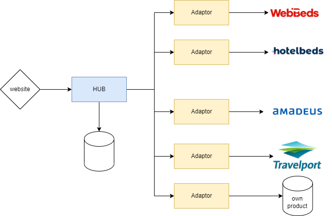

## Introduction

The POC Hub aims to simplify and standarize the integrations with **own** and **third party** product providers (e.g. hotel providers, flight GDSs, ...). That way we should be able to add new providers to POC in a very simple and predictable way (i.e. by creating an API which implements our interface). 

bla bla bla

At the end, we are in fact moving all the integrations and product logic out of the POC website (a.k.a. the monolith).

## How

By providing a set of specifications and infrastructure.

## The capabilities of the Hub

The main features / functionalities / responsabilities of the Hub are:

- Decide which providers should be fetched for any request
- Map ids from our internal value to the provider's code 
- Perform calls to translators
- Aggregate (and possibly filter) results
- Reverse map any provider code (when needed)
- Translate and complete responses (e.g. with data from POC Places)
- Measure performance and business values so further analysis can be done

##  The translators

The hub depends on implementors of the APIs to gather the product. Those API implementors can be translators to providers 
APIs (e.g. Hotelbeds, Amadeus, Travelport) or owned microservices which would serve our own product.

